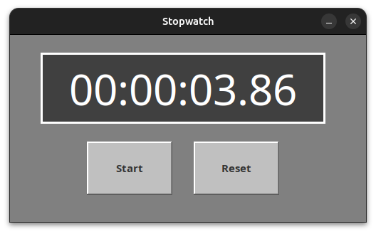

## Stopwatch Program in Java
This is a stopwatch program made using java swing!

The workspace is created in VSCode and contains two folders by default, where:

- `src`: the folder to maintain sources
- `bin`: the compiled output files will be generated in this folder by default.

## Steps (Using VSCode)
1. Install the Java Extension Pack for Java using VSCode
2. Clone the repository using the command `git clone https://github.com/ken85illo/Stopwatch.git`
3. Open the folder in VSCode
4. Run the Main.java file

## Run Jar File
- Do `Ctrl + Shift + P` to show command pallete in VSCode
- Click the `Java: Export Jar` and leave it as default name `Stopwatch`
- Open terminal and set the directory to the root folder using `cd` command
- Run the jar file using the command `java -jar .\Stopwatch.jar`

